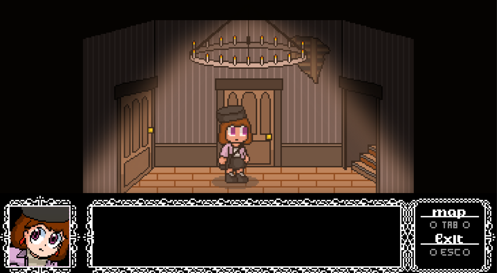
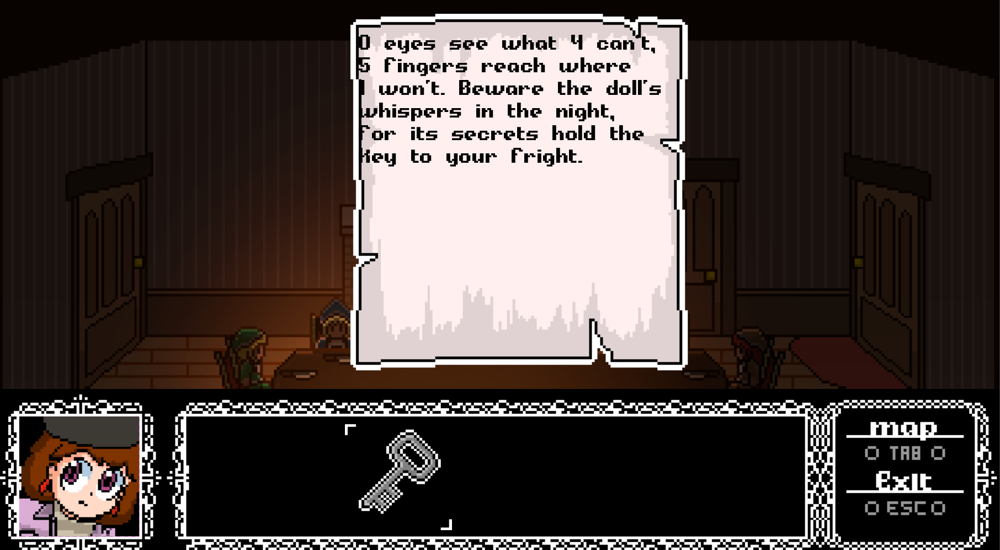
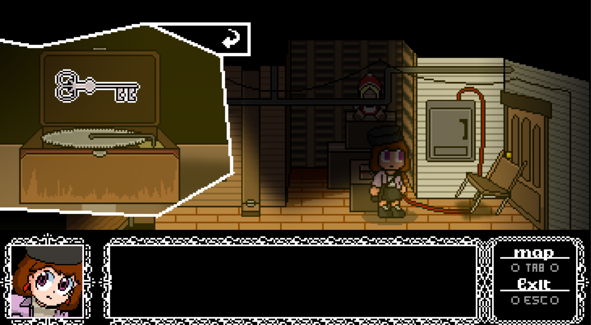

# Dollhouse

===========================================================================

Project created by Colton Thibert and Cole Dennie as a college project.
Created in Java using JavaFX from scratch.

===========================================================================

===========================================================================

# Controls:
| Button:               | Action:       |
| --------------------- |:-------------:|
| `A`              | Move Left          |
| `D`              | Move RIght         |
| `Mouse1`         | Interact           |
| `Tab`            | Map Display        |

===========================================================================

# Known Issues:
`- Moving in and out of a interactable and clicking anywhere else will cause to you to still interact with said item even when not in region of interactable.`

`- When holding forward or backwards when interacting with a door there's a chance footsteps may loop continuously after transition.`

